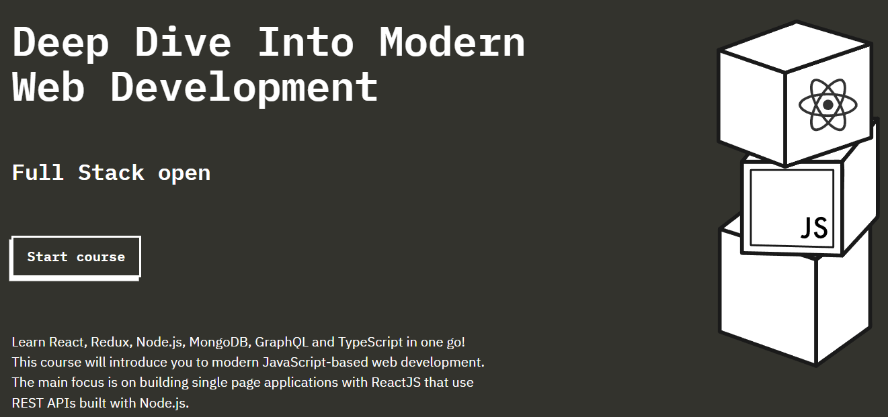

# Full Stack Open 2024 - University of Helsinki




This repository contains the exercises and projects completed during the [Full Stack open](https://fullstackopen.com/en/)
 course offered by the University of Helsinki.

## Course Overview

The Full Stack Open course dives deep into the development of web applications using JavaScript and modern technologies. The course provides a hands-on approach to building scalable web applications, focusing on both front-end and back-end development. Key concepts such as RESTful APIs, data management, testing, and continuous integration are explored, giving students the skills necessary to build production-level applications.

Technologies and tools you will work with include:

- [React](https://reactjs.org/docs/getting-started.html)
- [Redux](https://redux.js.org/introduction/getting-started)
- [Node.js](https://nodejs.org/en/docs)
- [Express](https://expressjs.com/en/starter/installing.html)
- [MongoDB](https://www.mongodb.com/docs/)
- [GraphQL](https://graphql.org/learn/)
- [TypeScript](https://www.typescriptlang.org/docs/)
- [Testing (Jest)](https://jestjs.io/docs/getting-started)
- [Testing (Cypress)](https://docs.cypress.io/guides/overview/why-cypress)
- [Docker](https://docs.docker.com/get-started/)


## Repository Structure

Each module or part of the course is organized in its respective folder, and within each folder, you will find the exercises and projects. The repository is structured as follows:


- part0: Fundamentals of Web apps
- [part1: Introduction to React](./part1)  
- [part2: Communicating with server](./part2)  
- [part3: Programming a server with NodeJS and Express](./part3)  
- [part4: Testing Express servers, user administration](./part4)  
- [part5: Testing React apps](./part5)  
- [part6: Advanced state management](./part6)  
- [part7: React router, custom hooks, styling app with CSS and webpack](./part7)  
- [part8: GraphQL](./part8)  
- [part9: TypeScript](./part9)  
- [part10: React Native](./part10)  
- [part11: CI/CD](./part11)  
- [part12: Containers](./part12)  
- [part13: Using relational databases](./part13)


Each folder represents a "part" of the course, and within each, there are subdirectories for the exercises and projects.

## How to Use this Repository

If you wish to clone this repository and explore the exercises on your own, follow these steps:

1. Clone the repository:

```bash
git clone https://github.com/your-username/fullstackopen2024.git
cd fullstackopen2024
```

To create all the folders related to each part of the project, go to your repository path and use the following code (PowerShell on Windows)

```bash
foreach ($i in 1..13) {
    mkdir "part$i"
}
```

Then, to add a readme.md to each part, use the following code:

```bash
foreach ($i in 1..13) {
    New-Item -Path "part$i/README.md" -ItemType "File"
}
```


2. Navigate to the part/module you are interested in:

```bash
cd part1
```

3. Install the necessary dependencies (if applicable):

```bash
npm install
```

4. Run the application or the tests (depending on the exercise):

```bash
npm start
```

## Useful Links

- [Official course website](https://fullstackopen.com/en/)
- [React documentation](https://reactjs.org/)
- [Node.js documentation](https://nodejs.org/)
- [MongoDB documentation](https://www.mongodb.com/)
- [Docker Guide](https://docs.docker.com/)

## Author

This repository is maintained by [marcosh17](https://github.com/marcosh17) as part of the exercises for the Full Stack Open 2024 course.

## License

This project is licensed under the MIT License. See the [LICENSE](LICENSE) file for more details.
